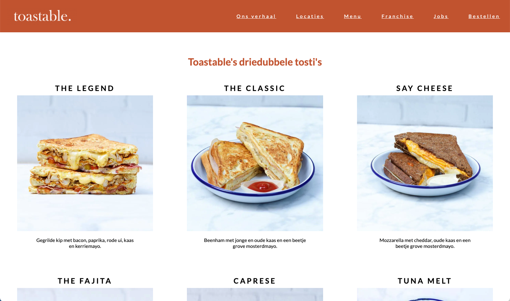

# Procesverslag
Markdown is een simpele manier om HTML te schrijven.  
Markdown cheat cheet: [Hulp bij het schrijven van Markdown](https://github.com/adam-p/markdown-here/wiki/Markdown-Cheatsheet).

Nb. De standaardstructuur en de spartaanse opmaak van de README.md zijn helemaal prima. Het gaat om de inhoud van je procesverslag. Besteedt de tijd voor pracht en praal aan je website.

Nb. Door *open* toe te voegen aan een *details* element kun je deze standaard open zetten. Fijn om dat steeds voor de relevante stuk(ken) te doen.

## Jij

  
uitwerken voor kick-off werkgroep

  ### Auteur:
  Bente van Bohemen 

  #### Je startniveau:
  Blauw,  en als het lukt rood

  #### Je focus:
  Responsive 
 

## Je website

  
uitwerken voor kick-off werkgroep

  ### Je opdracht:
  https://toastable.nl
  

  #### Screenshot(s) van de eerste pagina (small screen): 
  Home pagina  
  

  #### Screenshot(s) van de tweede pagina (small screen):
  Menu pagina  
  
 

## Toegankelijkheidstest 1/2 (week 1)

  
uitwerken na test in 2e werkgroep

  ### Bevindingen
  Lijst met je bevindingen die in de test naar voren kwamen:
    - Veel fouten in de html code.
    - Bij mobiel formaat van content uit verhouding.
    - Alleen in de footer staat een li voor de rest is alles div of section.
    - Geen alt teksten, aleen alt srcset met slechte benaming.
    - De video begint automatisch en kan je niet stop zetten.
    - Kleuren van navigatie niet genoeg contrast.

## Breakdownschets (week 1)

  
uitwerken na afloop 3e werkgroep

  ### de hele pagina: 
  

  ### dynamisch deel (bijv menu): 
  

## Voortgang 1 (week 2)

  
uitwerken voor 1e voortgang

  ### Stand van zaken
  hier dit ging goed & dit was lastig (neem ook screenshots op van delen van je website en code)

  Ging goed: Ik heb vanaf het begin goed mee gedaan in de les en heb alle oefeningen gemaakt. Hierdoor kan ik nu goed bij blijven. Ik heb wel geleerd van vorig jaar dat voor mij dat belangrijk is. Hierdoor heb ik van 1 pagina alle html af en kan ik vandaag verder aan de 2e pagina. Door de oefeningen denk ik dat het opzetten van de css goed moet lukken.

  Dit was lastig: Ik vond in de eerste week de toegankelijkheid met de screenreader wel lastig. Ik kreeg niet onder de knie hoe je dit nou moest gebruiken. Ook vond ik grid op het begin wel even lastig maar na het doen van de oefeningen ging dat beter.

  ### Agenda voor meeting
  samen met je groepje opstellen

  | Bente            | Jamie              | Tim          | Sanne       | Mearen       |
  | ---              | ---                | ---          | ---         | ---          |
  | Toegankelijkheid | HTML checken       | HTML         |             | HTML checken |
  | Quote            |                    | css          |             |              |
  | HTML checken     |                    |              |             |              |
  | Formaat foto's   |                    |              |             |              |

  ### Verslag van meeting
  hier na afloop snel de uitkomsten van de meeting vastleggen

  - punt 1: Zorg voor goede heading levels
  - punt 2: Alle linkjes doorverwijzen naar andere vormgegeven pagina.
  - punt 3: Nav in de footer
  - punt 4: Foto galerei als je klinkt vergroot de foto

## Voortgang 2 (week 3)

  
uitwerken voor 2e voortgang

  ### Stand van zaken
  Ik heb nu mijn grid op de eerste pagina toegevoegd en ik moet zetten dat het lastiger is dan ik dacht. Het lukt daarbij niet goed om het in het midden op het achtergrond item te zetten. Ik ga hier in het voortgansgesprek over vragen. 

  Het gaat we goed met flexbox ik denk dat ik dat nu wel redelijk onder de knie heb. Ik hoop dat het ook lukt bij mijn 2e pagina. Ik vind bij flexbox alleen het uitklap menu lastig.

  Ik ga er dit weekend weer verder aan zodat als ik vragen heb die dinsdag in de les kan na vragen.

  ### Agenda voor meeting
  samen met je groepje opstellen

  | Bente            | Jamie              | Tim            | Stella         | Mearen          |
  | ---              | ---                | ---            | ---            | ---             |
  | Toegankelijkheid | Hamburger menu     | HTML           | Hamburger menu | HTML checken    |
  | Responsive       |                    | Hamburger menu |                | Gedownlaod font |
  | HTML checken     |                    |                |                |                 |
  | Grid voor foto's |                    |                |                |                 |
  | Uitklap menu     |                    |                |                |                 |

  ### Verslag van meeting
  hier na afloop snel de uitkomsten van de meeting vastleggen

  - punt 1: Hamburger menu is uitgelegd en laten zien hoe het werkt
  - punt 2: Flexbox is toegapst op een paar plekken van mijn webiste
  - punt 3: Ik heb vragen gesteld op ik met grid mijn website responsive kan maken
  - punt 4: Ik heb geleerd over object fit: cover, dit had ik nodig bij mijn foto collage.

## Toegankelijkheidstest 2/2 (week 4)

  
uitwerken na test in 9e werkgroep

  ### Bevindingen
  Lijst met je bevindingen die in de test naar voren kwamen (geef ook aan wat er verbeterd is):
  - punt 1: Validate gaf 6 fouten eerst 66 fouten, ging over articles die geen heading level hadden. Rest heb ik aangepast.
  - punt 2: Focus state moet ik nog aanpassen aan de website.
  - punt 3: Formaat van content was eerst uit verhouding, dit heb ik zelf veranderd.
  - punt 4: Eerst werden er geen ul,li enz gebruikt. Dit heb ik wel in mijn website.
  - punt 5: Ik heb aan alle elementen een alt text toegevoegd.
  - punt 6: Video begint niet meer automatisch, je kan hem zelf starten en stoppen als je wil.
  - punt 7: A elementen gebruikt voor links in plaats van buttons.
  - punt 8: Dark en light mode en high-contrast mode niet ik nog toevoegen.
  - punt 9: ::selection colors toegevoegd.

## Voortgang 3 (week 4)

  
uitwerken voor 3e voortgang

  ### Stand van zaken
  hier dit ging goed & dit was lastig (neem ook screenshots op van delen van je website en code)

  Ik ben verder gegaan met mijn eerste pagina, ik heb deze nu bijna af. Het verder werken en het elementen aanroepen lukte mij best goed. Soms had ik nog war moeite met flexbox en daarmee elementen plaatsen. Ik heb wel door mijn docent geleerd dat als ik vis enspecteren naar mijn website kijk ik fouten sneller kan ondekken. Ik moet mijn hamburger menu alleen nog wel maken en daar zit ik tegen op. Ik merk datik dat toch best lastig vind. Toch ga ik hier morgen mee beginnen en kan ik hulp vragen aan mijn medestudenten als het niet lukt.

  Ik krijg steeds meer plezier erin als het lukt. Ik hoop morgen mijn 2e pagina af te maken. Ik heb al een lijst gemaakt van dingen die in tot nu toe nog moet doen en ga dit afmaken als ik de 2e pagina af heb. Ik heb vertrouwen erin dat het gaat lukken.

  ### Agenda voor meeting
  samen met je groepje opstellen

  | Bente            | Jamie              | Tim            | Sara           | Mearen          |
  | ---              | ---                | ---            | ---            | ---             |
  | Toegankelijkheid | Hamburger menu     | HTML           | Hamburger menu | HTML checken    |
  | Responsive       |                    | Hamburger menu |                | Gedownlaod font |
  | HTML checken     |                    |                |                |                 |
  | Footer           |                    |                |                |                 |
  | Sreenreader      |                    |                |                |                 |

  ### Verslag van meeting
  hier na afloop snel de uitkomsten van de meeting vastleggen

  - We hebben het over formulieren gehad, maar had ik niet veel aan want ik heb geen formulier op mijn website.
  - Ik vragen kunnen stellen over hoe ik het best mijn footer op kan roepen.
  - We hebben het gehad over dark/light mode, dat je het dan het beste een andere achtergrond kleur moet geven en dan kleuren om kan draaien voor het hoogste contrast.
  - Ik heb voor de rest vooral naar de vragen van de andere geluisterd.

## Eindgesprek (week 5)

  
uitwerken voor eindgesprek

  ### Je uitkomst - karakteristiek screenshots:
  
  
  
  
  
  

  ### Dit ging goed/Heb ik geleerd: 
  Korte omschrijving met plaatjes

  Ik heb geleerd om met een grid een responsive design te maken. Ik vond dit super leuk om te leren, omdat ik dit al een lange tijd wilde kunnen. Ik dacht dat dit heeeel lastig zou zijn maar uiteindelijk viel dit reuze mee. Hierdoor kon ik de vormgeving van me site veel beter maken. Samen met flexbox heb ik hiermee bijna heel me site gemaakt.
  
  
  

  Iets wat ik zeker ook heb geleerd is om door middel nth-of-type je veel makkelijker dingen kun selecteren. Hierdoor hoefde ik ook bijna geen classes en divs te gebruiken. Soms moest ik goed zoeken of ik wel de juiste benaming had en hoe ik de juiste benaming dan kon vinden. Maar met inspecteren lukte dit al een stuk beter en begreep ik mijn eigen code soms ook beter.
  

  ### Dit was lastig/Is niet gelukt:
  Het hamburgermenu die responsive moest zijn vond ik toch wel echt het lastigste. Ondanks dat ik hier veel oefeningen van heb gedaan duurde het super lang voordat ik het begreep. Daardoor ging ik het ook zeker uitstellen en dat hielp natuurlijk ook niet. Uiteindelijk na veel onderzoek is het met toch gelukt. Ik denk dat het zeker op nog veel meer andere (betere) manieren kan maar toch ben ik best trots dat het gelukt is. 

  
  
  

## Bronnenlijst

  
continu bijhouden terwijl je werkt

  Nb. Wees specifiek ('css-tricks' als bron is bijv. niet specifiek genoeg). 
  Nb. ChatGpT en andere AI horen er ook bij.

  1.  https://www.flaticon.com (meerdere icons van gedownload)
  2.  https://developer.mozilla.org/en-US/docs/Web/CSS/justify-self
  3.  https://www.scaler.com/topics/image-button-in-html/
  4.  https://www.w3schools.com/css/css_grid_container.asp
  5.  https://www.w3schools.com/css/css_positioning.asp
  6.  https://dlo.mijnhva.nl/d2l/le/content/536487/Home
  7.  https://dlo.mijnhva.nl/content/enforced/536487-FDMCI-2000FED121-DMCI-CMD-2324/FED%2023-24%20-%20Blok%201%20-%20Oefening%20states.pdf
  8.  https://www.w3schools.com/css/css_rwd_mediaqueries.asp
  9.  https://brittons.nl/cake-plaatgebak
  10. https://toastable.nl/
  11. https://dlo.mijnhva.nl/content/enforced/536487-FDMCI-2000FED121-DMCI-CMD-2324/FED%2023-24%20-%20Blok%201%20-%20Light-Dark%20recap.pdf
  12. https://developer.mozilla.org/en-US/docs/Web/CSS/justify-content
  13. https://codepen.io/mutedblues/pen/MmPNPG?editors=1100
  14. https://codepen.io/shooft/pen/jOzQppJ

